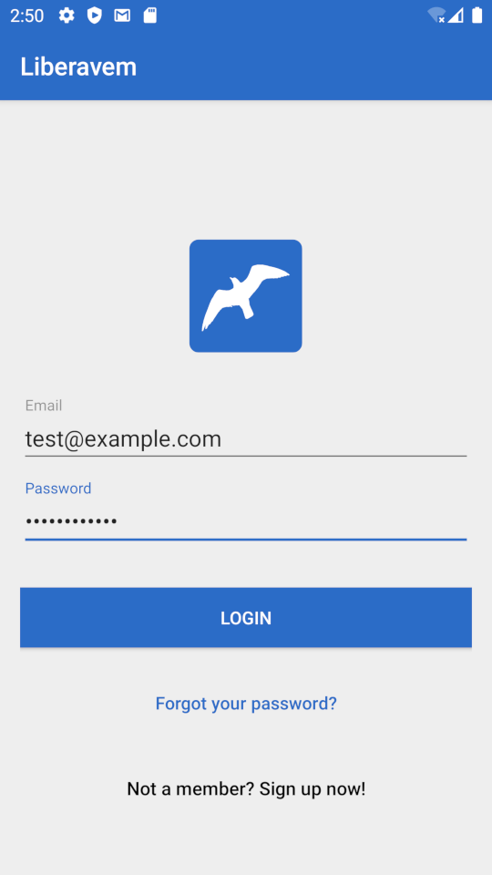
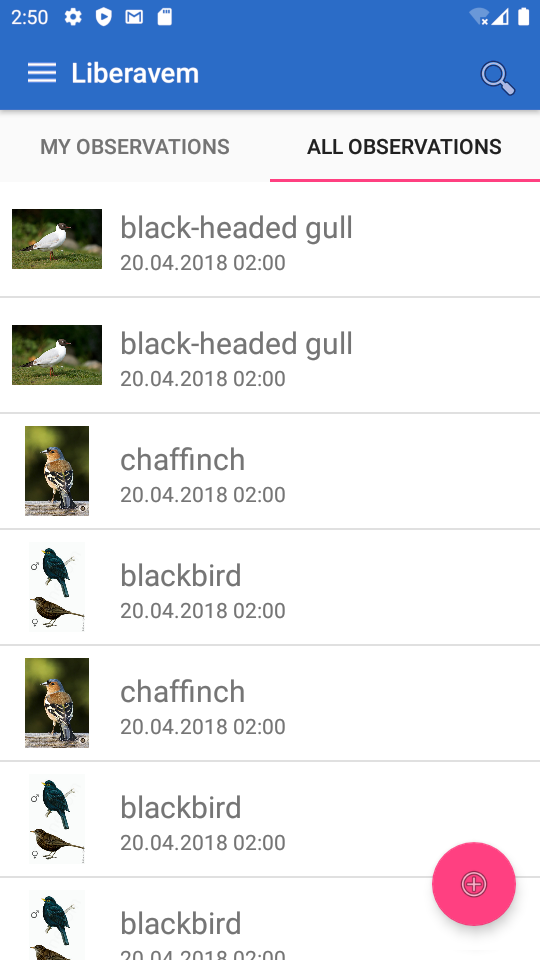
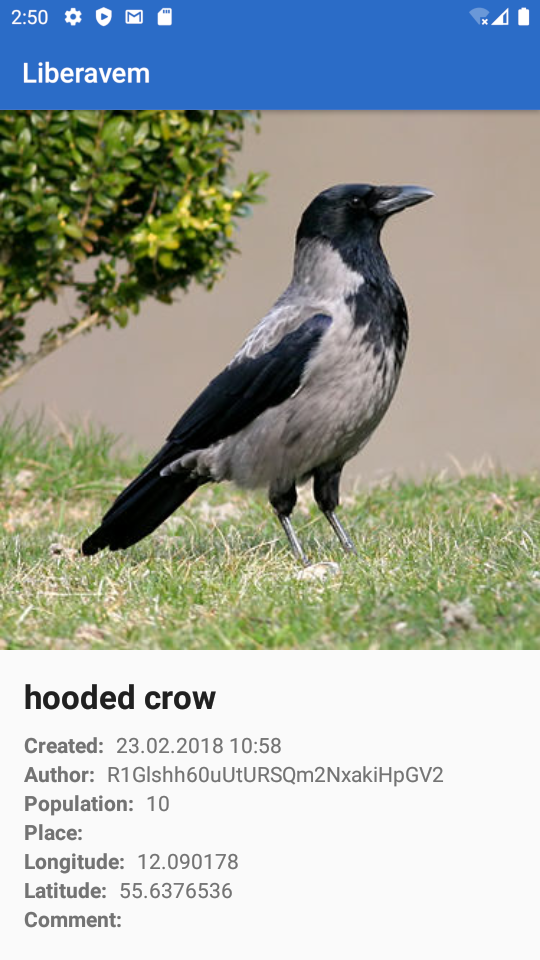

# Liberavem

A simple Android app for collecting bird observations. Made during Mobile Development elective course at Erhvervsakademi Sjælland.

## Preview

| Login screen                    | Observations list               | Observation details             |
| ------------------------------- | ------------------------------- | ------------------------------- |
|  |  |  |

## Description

The application allows saving bird observations with details such as time, location and population. It is possible to later browse your observations, as well as those made by other users.

The app is written in Java with Android SDK. It connects to a REST API to save and retrieve data about birds and observations. The login and registration functionality is using Firebase.
